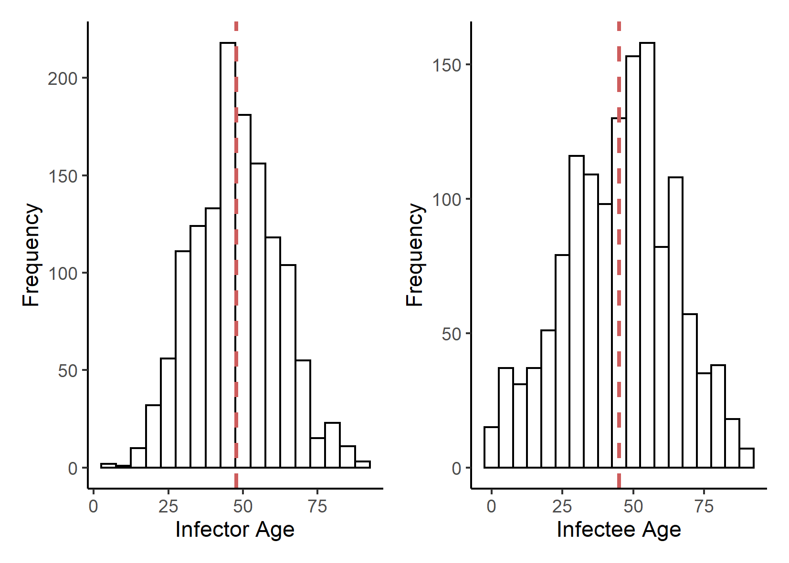
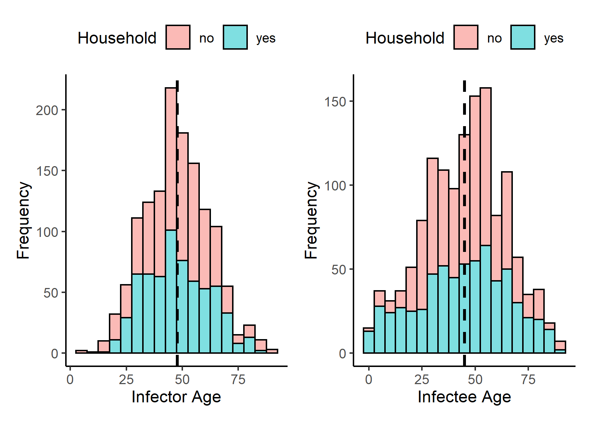
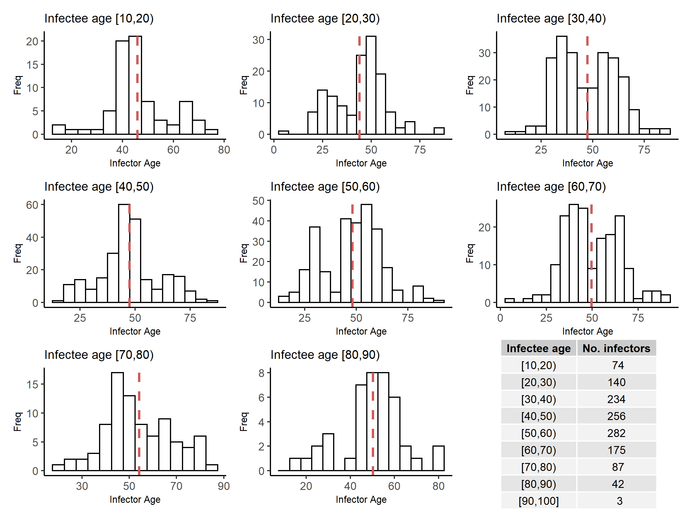
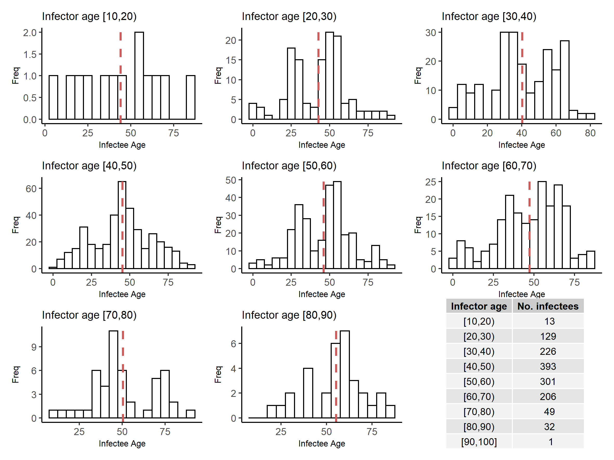
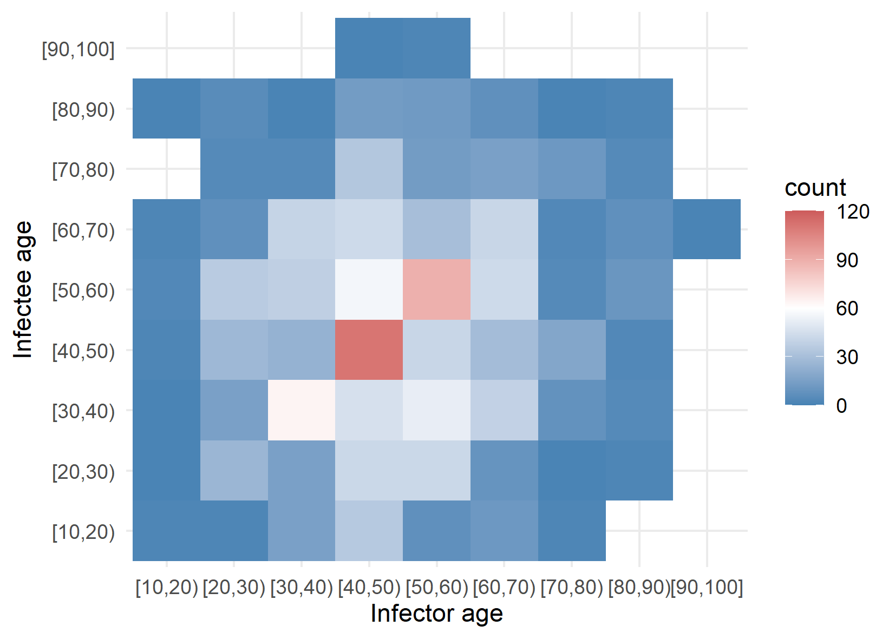
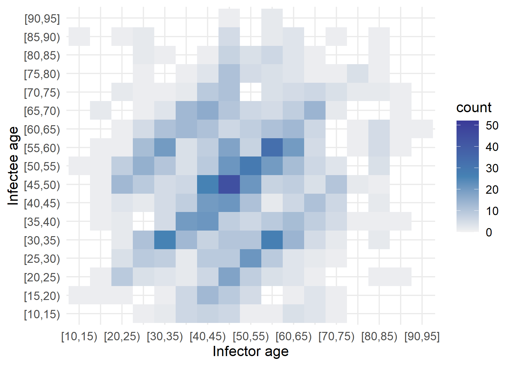
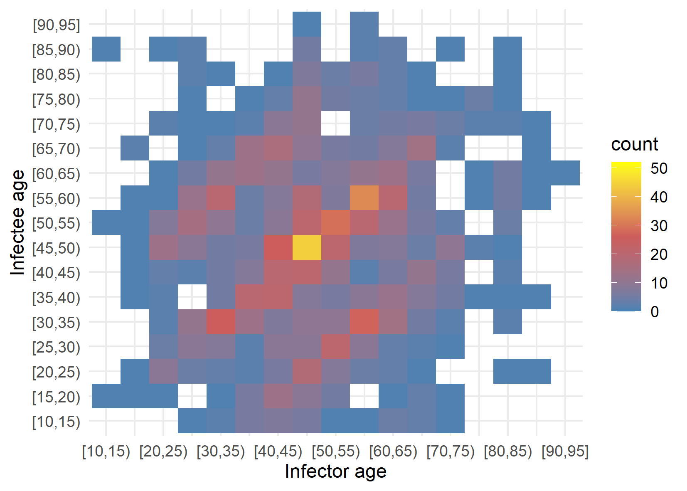
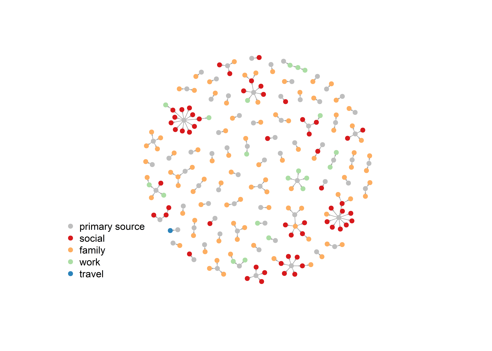
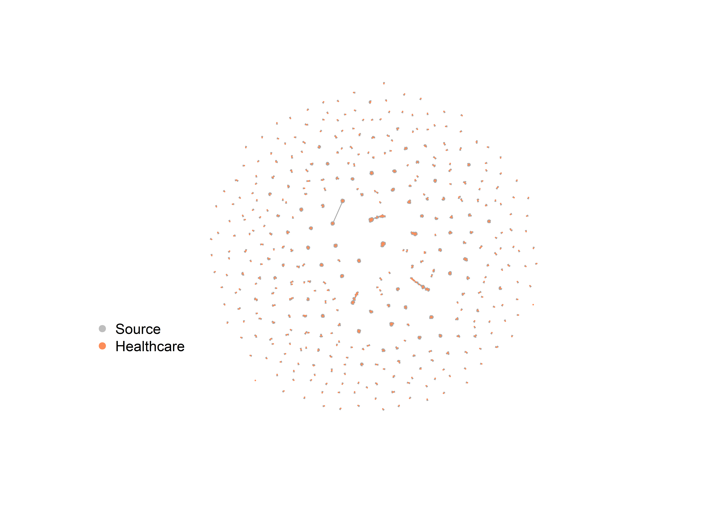
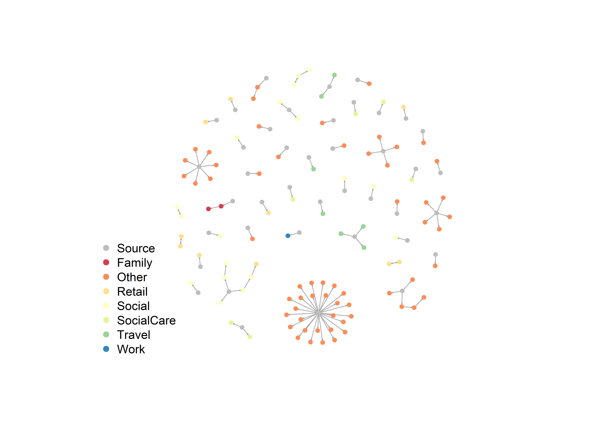

```{r setup, include=FALSE}
knitr::opts_chunk$set(echo = FALSE)
```

```{r eval=FALSE}
for (i in list.files(pattern = ".png")) {
    cat("```{r echo=FALSE, fig.cap=\"\"}", "\n", "knitr::include_graphics(\"", i, "\")", "\n", "```", "\n\n\n", sep = "")
}
```


# China dataset

## Infector and infectee age distributions  

```{r echo=FALSE, fig.cap=""}

```

\bigskip
\bigskip
## Infector and infectee age distribution by household 

```{r echo=FALSE, fig.cap=""}

```

\bigskip
## Infector age distribution stratified by infectee age

```{r echo=FALSE, fig.cap=""}

```

\bigskip
## Infectee age distribution stratified by infector age

```{r echo=FALSE, fig.cap=""}

```

\bigskip
## Age-specific infection patterns

```{r echo=FALSE, fig.cap=""}

```

\bigskip
\bigskip
```{r echo=FALSE, fig.cap="", fig.show="hold", out.width="50%"}


```


\newpage
# Hong Kong data set

## Network visualisation of transmission chains

```{r echo=FALSE, fig.cap=""}

```

\newpage
# Korea dataset

## Network visualisation of hospital transmission

```{r echo=FALSE, fig.cap=""}

```

\bigskip
\bigskip
## Network visualisation of transmission by setting

```{r echo=FALSE, fig.cap=""}

```
