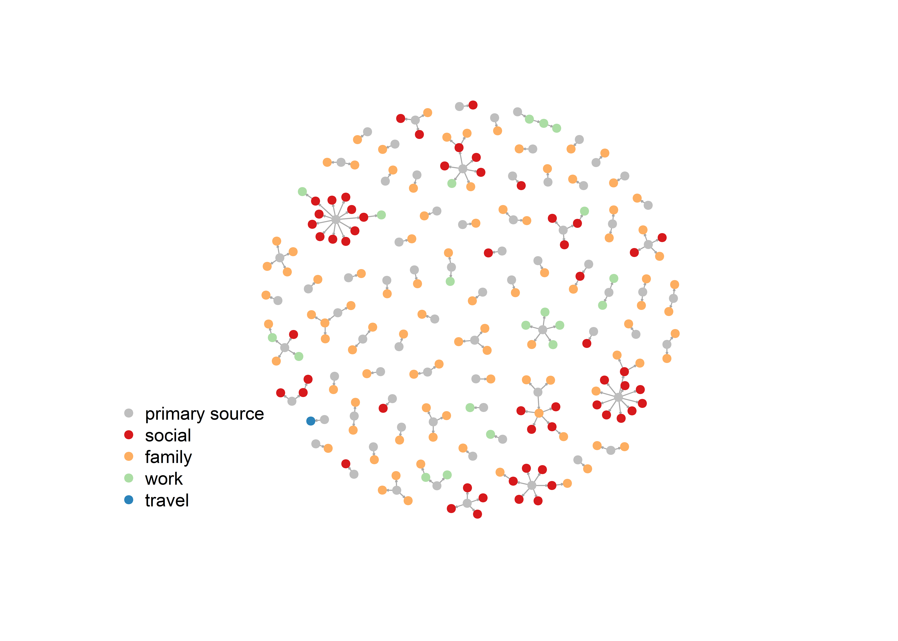
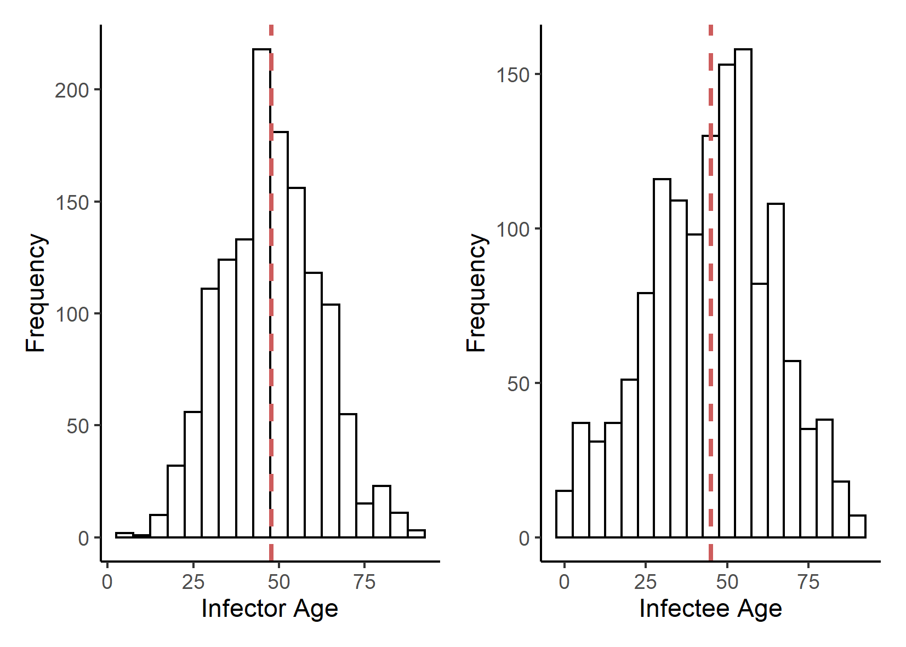
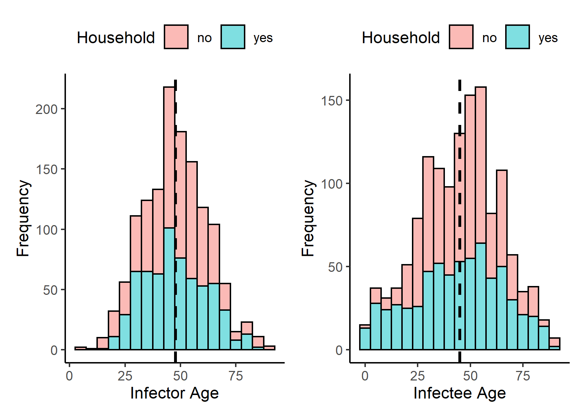
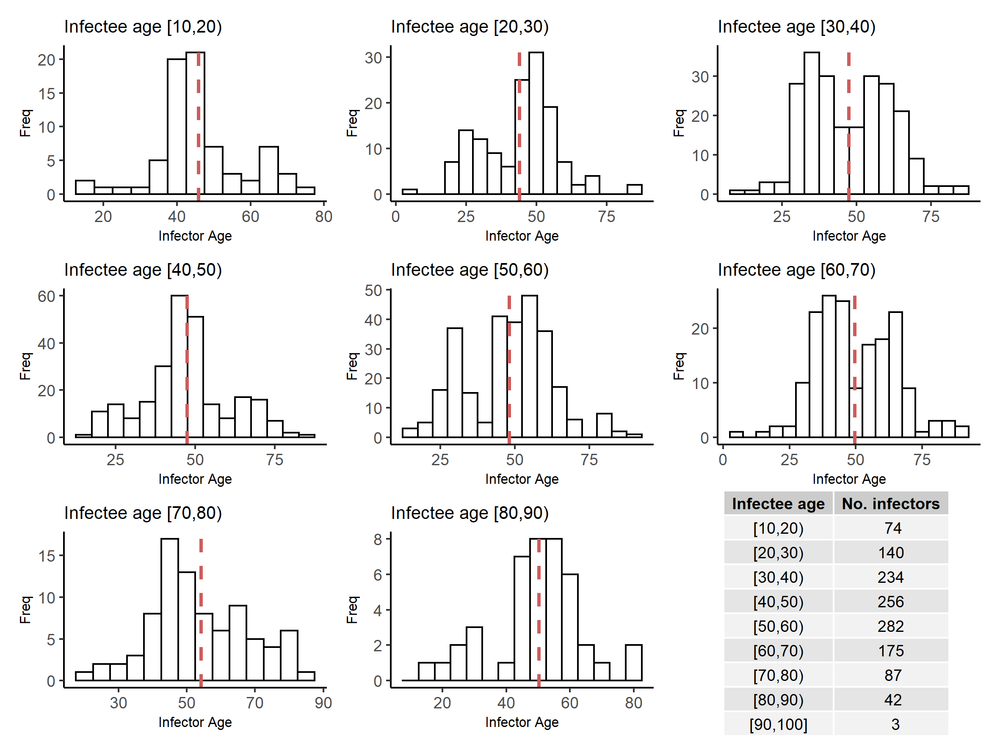
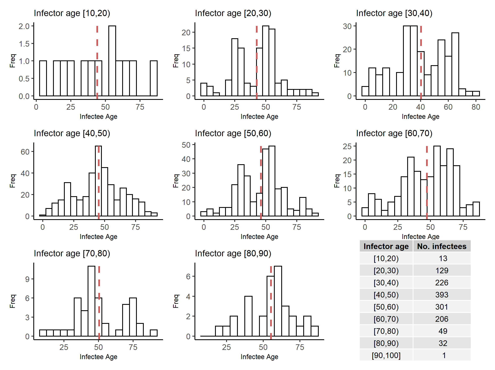
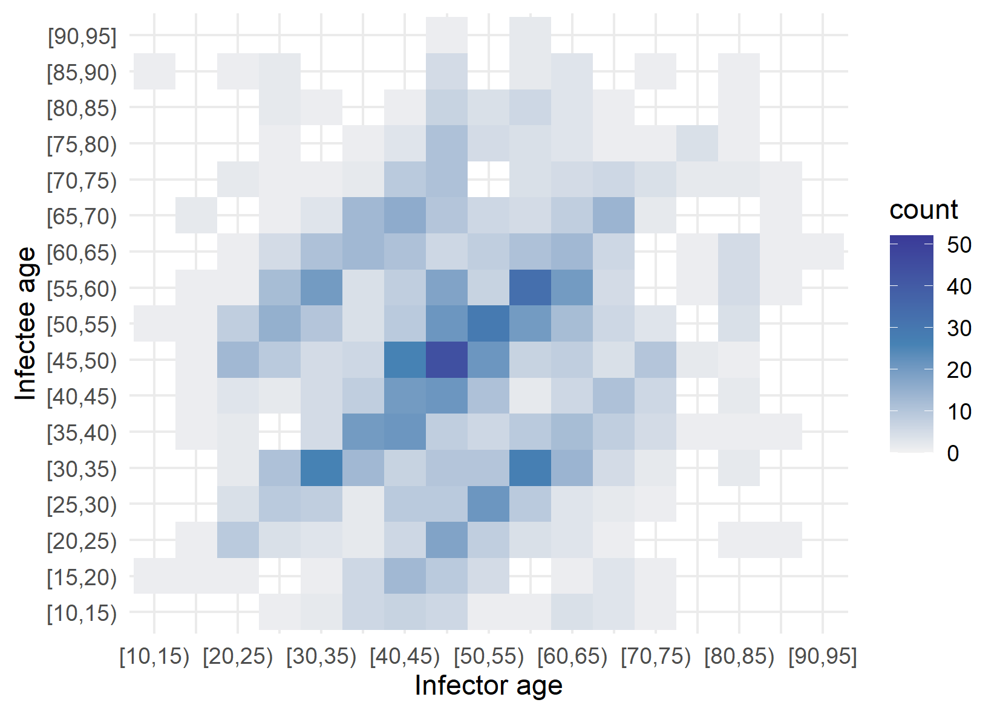
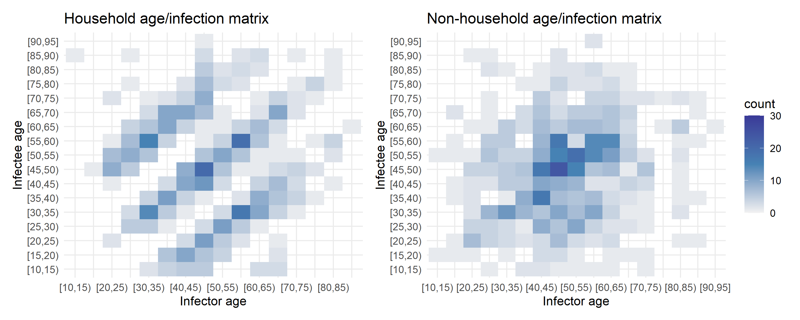

```{r setup, include=FALSE, message=FALSE, warning=FALSE}
knitr::opts_chunk$set(echo = FALSE, message = FALSE, warning = FALSE)
```

```{r eval=FALSE, include=F, echo=FALSE}
# An imprecise but sufficient word count tool 
wc_fn = function(x = character) return(length(stringr::str_split(x, " ")[[1]]))
wc_fn("")
```


# Background
* Not all infectors are born equal i.e. SARS-CoV-2 transmission is heterogeneous.
* Most individuals don’t infect anybody while a few are responsible for the majority of transmission.
* Superspreading events hit the news in 2020.

* Characterise the R-distribution == secondary case distribution
* How does the contact pattern affect the shape of the secondary case distribution?
* How does the setting of spreading affect the shape of the secondary case distribution?

### $R$, reproductive number
* %R% is the average number of secondary infections produced by a typical case of an infection in a population.
* If $R>1$, there is a chance of an epidemic.  
* Depends on: 
  * The rate of contacts in the host population.
  * The probability of infection being transmitted during contact.
  * Infectiousness of viral strain, susceptibility to infection, proximity of contact
  * The duration of infectiousness.

### Secondary case distribution
* Not all infectors are born equal;
  * i.e. SARS-CoV-2 transmission is heterogeneous.
* Hence, a secondary case distribution.
* The mean of the secondary case distribution is R.
* Characterised by a shape, variance, range, etc. 

### How do we characterise the secondary case distribution? 
* Current assumption: negative binomial distribution.
* Is this necessarily the best assumption in all scenarios? 
  * there is no test/proof to support this assumption although it "works"
* Transmission is clustered with relatively high _aggregation_ (parameter which describes the extent of clustering). 

* Most individuals do not infect anybody while a few are responsible for the majority of transmission.
* Higher maximum number of new cases.
* A lower percentage of infectors are responsible for majority of new infections == superspreaders. 

### Clustering
* Depends on (similar things like $R$): 
  * The rate of contacts in the host population. 
  * The probability of infection being transmitted during contact.
  * Infectiousness of viral strain, susceptibility to infection, proximity of contact 
  * The duration of infectiousness.
* How does the contact pattern affect the secondary case distribution? 
* Assume distinct settings comprise distinct contact patterns.
* How does the setting of spreading affect the shape of the secondary case distribution?


# Research question
***How does the setting of SARS-CoV-2 infection affect the shape of the secondary case distribution?***

# Methods
* Find publicly available transmission data in the literature;
* Aggregate data sets and group transmission chains by setting;
  * social, hospital, work, family, leisure, education, etc
* Fit and compare different distributions to the data to test the negative binomial assumption.

## Data used 
### Publicly available data
* Limited data availability
* Not public and derived from models assuming neg binom 
* Negative correlation between GDPR and data availability 
* Resolution and availability of data decreased over time
* Media and news reports: a substantial chunk of data
* Bias towards superspreading and early pandemic
* public private distinction media superspreading events

### Datasets used (all) 
* Korean Contact Tracing: patients, infectors (where known), detailed location of infection, age, sex, date confirmed that they had the virus.
* COVID-19 Settings of Transmission: setting (category), indoor/outdoor, country, city, reference (predominantly news articles), number of clusters, primary cases (where known), secondary cases (where known), total number of cases per cluster.
* Transmission pairs: infector, infectee, ‘cluster risk’ (family, social, work, travel), cluster generation, pair type (imported or local), dates of primary and secondary infections.
* China Contact Tracing: infector, infectee, ages, city, province, dates of infection, household/non-household but no information on settings.

### Dataset #1: COVID-19 contact tracing data in mainland China
Infector, infectee, ages, city, province, dates of infection, household/non-household but no information on settings.
### Dataset #2: COVID-19 contact tracing data in Hong Kong
Infector, infectee, ‘cluster risk’ (family, social, work, travel), cluster generation, pair type (imported or local), dates of primary and secondary infections.


# Restults

### Clusetring - network diagrams

```{r, fig.pos="p"}
### Transmission by setting 
# Hong Kong

```


### Freq distribution by age and household.
Household and non-household age distributions are very similar. \smallskip \newline
Kolmogorov-Smirnov Tests:
\begin{itemize}
    \item Infector ages: 
        \begin{description}
        \item D = 0.071691, \emph{p-value = 0.0627}
        \end{description}
    \item Infectee ages:
        \begin{description}
        \item D = 0.11277, \emph{p-value = 0.00036}
        \end{description}
    \end{itemize}

```{r out.width="50%", fig.pos="p"}
### Frequency distribution by age and household
# China


```

Who is infecting whom? \medskip \newline

```{r out.width="50%", fig.pos="p"}
### Infector age distribution stratified by infectee age
# China

### Infectee age distribution stratified by infector age
# China

```

### Age-specific infection patterns 

```{r out.width="50%", fig.pos="p"}
### Age-specific infection patterns
# China

```

### Age-specific infection patterns - household vs non-household transmission

```{r out.width="66%", fig.pos="p"}
### Age-specific infection patterns: household/non-household
# China

```


# Discussion 
### Some problems with the data
* Limited data availability. 
* Resolution and availability of data decreased over time.
* Secondary distribution data derived from models
* Models assume negative binomial distribution 
* Sources: media and news reports make a substantial chunk of “interesting” data 
* Bias towards superspreading and early stage of pandemic
* Different transmission dynamics

### Impacts and conclusions 
* SARS-CoV-2 transmission strongly governed by age.
* The importance of age-specific contact patterns is not novel.
* Why are there no long chains of transmission?
  * seen in SARS and other infections
* Even some qualitative/descriptive treatment of the data can yield interesting observations and insightful questions.

# To Do
* Look at dates and restrictions at the time of data collection!
* Look at other data sets which track age/household


